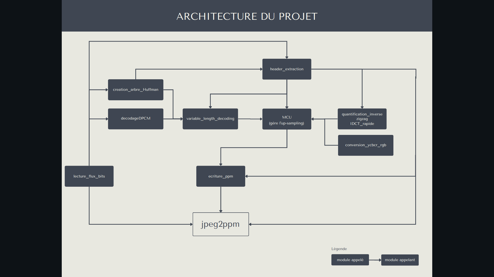

# Notre décodeur JPEG à nous

Bienvenue sur la page d'accueil de _votre_ projet JPEG, un grand espace de liberté, sous le regard bienveillant de vos enseignants préférés.
Le sujet sera disponible dès le mardi 2 mai à l'adresse suivante : [https://formationc.pages.ensimag.fr/projet/jpeg/jpeg/](https://formationc.pages.ensimag.fr/projet/jpeg/jpeg/).

Comme indiqué lors de l'amphi de présentation, vous devrez organiser un point d'étape avec vos enseignants pour valider cette architecture logicielle.
Cette page d'accueil servira de base à cette discussion. En pratique, vous pouvez reprendre son contenu comme bon vous semble, mais elle devra au moins comporter les infos suivantes :

1. des informations sur le découpage des fonctionnalités du projet en modules, en spécifiant les données en entrée et sortie de chaque étape ;
2. (au moins) un dessin des structures de données de votre projet (format libre, ça peut être une photo d'un dessin manuscrit par exemple) ;
3. une répartition des tâches au sein de votre équipe de développement, comportant une estimation du temps consacré à chacune d'elle (là encore, format libre, du truc cracra fait à la main, au joli Gantt chart).

Rajouter **régulièrement** des informations sur l'avancement de votre projet est aussi **une très bonne idée** (prendre 10 min tous les trois chaque matin pour résumer ce qui a été fait la veille, établir un plan d'action pour la journée qui commence et reporter tout ça ici, par exemple).

# Liens utiles

- Bien former ses messages de commits : [https://www.conventionalcommits.org/en/v1.0.0/](https://www.conventionalcommits.org/en/v1.0.0/) ;
- Problème relationnel au sein du groupe ? Contactez [Pascal](https://fr.wikipedia.org/wiki/Pascal,_le_grand_fr%C3%A8re) !
- Besoin de prendre l'air ? Le [Mont Rachais](https://fr.wikipedia.org/wiki/Mont_Rachais) est accessible à pieds depuis la salle E301 !
- Un peu juste sur le projet à quelques heures de la deadline ? Le [Montrachet](https://www.vinatis.com/achat-vin-puligny-montrachet) peut faire passer l'envie à vos profs de vous mettre une tôle !

# Avancemnent du projet

Nous sommes heureux d'écrire ici, après 3 semaines de projet, que l'on a un décodeur fonctionnel pour les images jpeg codée en mode Baseline (avec une iDCT rapide). Nous avons testé notre programme seulement sur les images fournies pour le moment.

# Architecture

(Deux modules ne sont pas représentés sur le graphique, ils sont annexes et servent pour l'utilisation de macros et de fonctions génériques comme l'affichage d'un tableau par exemple)

# Structures de données

Nous avons utilisé plusieurs structures de données pour mener à bien ce projet, qui sont pour les plus importantes :

- Une structure d'arbre pour implémenter les arbres de Huffman et pour les créer, nous avons utilisé une structure de file pour créer l'arbre profondeur par profondeur (parcours en largeur),
- Une structure "struct header" qui permet de stocker en plusieurs sous-structures les informations de l'en-tête auxquelles on pourra accéder grâce à des fonctions (comme un arbre de huffman, une table de quantification, ou bien des valeurs de sinus pour accélérer le calcul de l'iDCT),
- Une structure "struct extended_FILE", qui tout comme le type natif FILE permet d'ouvrir un fichier et de lire dedans, mais offre en plus de cela la possiblilité de lire un nombre de bits précis (1, 3, 13 bits ...).